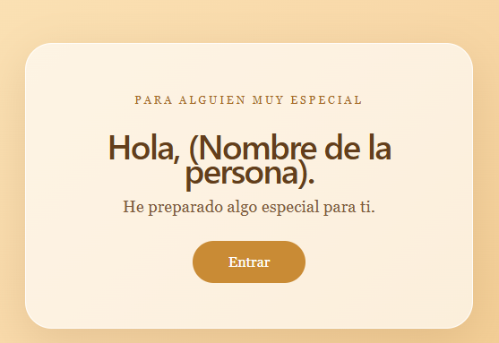
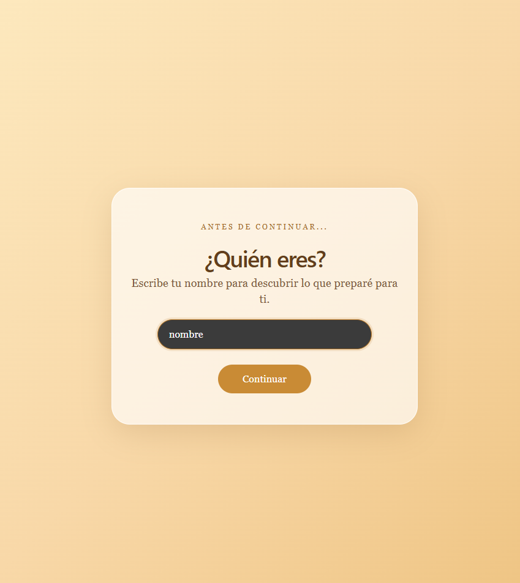
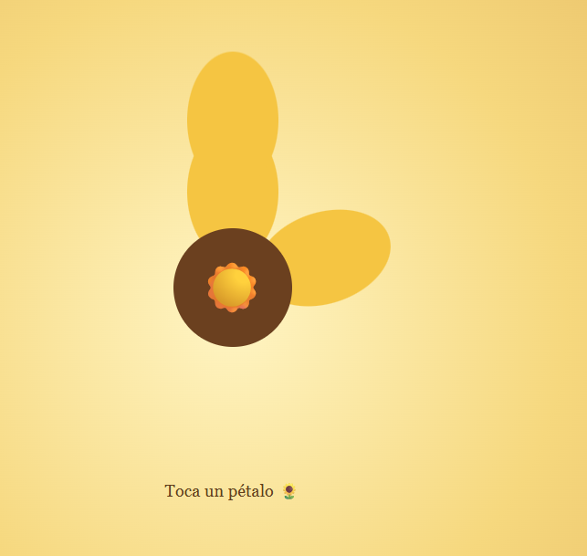
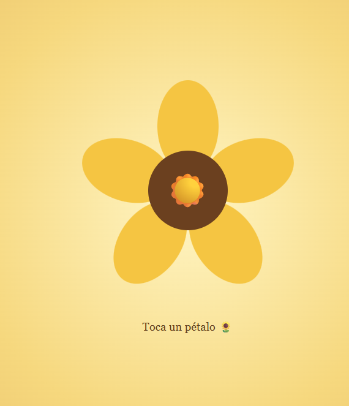
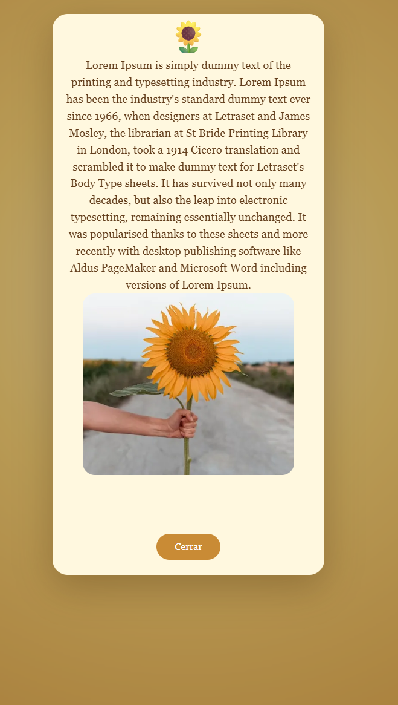

# 🌻 Girasol

Una experiencia web romántica e interactiva creada con **React + Vite**, pensada para convertirse en un regalo digital personalizado para tu pareja.

Puedes clonar este proyecto, cambiar las fotografías, mensajes y otros detalles, y convertirlo en tu propio regalo.

> Una pequeña página para transformar recuerdos, fotografías y palabras en una experiencia especial. ❤️

---

## ✨ Características

* 🌻 Girasol interactivo.
* 💛 Animación de pétalos cayendo y formando el girasol.
* 💌 Validación personalizada del nombre.
* 📸 Una fotografía diferente para cada pétalo.
* 💭 Mensajes románticos personalizados.
* 🎵 Posibilidad de agregar un enlace de YouTube.
* ✨ Animaciones al seleccionar los pétalos.
* 📱 Diseño responsive para dispositivos móviles.
* 💻 Compatible con escritorio.
* 🚀 Preparado para desplegarse en servicios como Vercel.

---

## 🎬 ¿Cómo funciona?

La experiencia sigue este flujo:

```text
Pantalla de bienvenida
        ↓
Personalización / nombre
        ↓
Girasol
        ↓
Pétalos cayendo
        ↓
Seleccionar un pétalo
        ↓
Animación
        ↓
Fotografía + mensaje
        ↓
Cerrar mensaje
        ↓
El pétalo vuelve a su posición
```

Cada pétalo representa un mensaje y puede tener una fotografía diferente.

El último pétalo también puede incluir un enlace especial, por ejemplo una canción de YouTube.

---

# 🚀 Instalación

## 1. Clonar el repositorio

```bash
git clone URL_DEL_REPOSITORIO
```

Después entra en la carpeta:

```bash
cd girasol
```

## 2. Instalar dependencias

```bash
npm install
```

## 3. Ejecutar el proyecto

```bash
npm run dev
```

Vite mostrará una dirección similar a:

```text
http://localhost:5173
```

Ábrela en tu navegador.

---

# 💕 Personalización

La idea principal de este proyecto es que puedas **personalizarlo fácilmente para tu pareja**.

La mayoría del contenido que necesitas cambiar se encuentra en:

```text
src/data/mensajes.js
```

y:

```text
public/imagenes/
```

---

## 👤 Cambiar el nombre

La validación del nombre se encuentra en:

```text
src/components/ValidacionNombre.jsx
```

Busca:

```js
if (nombre.trim().toLowerCase() === "nombre") {
```

Y reemplázalo por el nombre que quieras.

Por ejemplo:

```js
if (nombre.trim().toLowerCase() === "ana") {
```

Así la experiencia podrá continuar cuando la persona escriba ese nombre.

---

# 📸 Agregar tus fotografías

Coloca tus fotografías dentro de:

```text
public/
└── imagenes/
    ├── foto1.jpg
    ├── foto2.jpg
    ├── foto3.jpg
    ├── foto4.jpg
    └── foto5.jpg
```

Puedes utilizar tus propias fotografías.

Después puedes asociarlas con cada mensaje desde:

```text
src/data/mensajes.js
```

Por ejemplo:

```js
{
  id: 1,
  imagen: "/imagenes/foto1.jpg",
  texto: "Me encanta cada momento que compartimos."
}
```

---

# 💌 Personalizar los mensajes

Abre:

```text
src/data/mensajes.js
```

Encontrarás algo similar a:

```js
const mensajes = [
  {
    id: 1,
    imagen: "/imagenes/foto1.jpg",
    texto: "Tu mensaje aquí..."
  },

  {
    id: 2,
    imagen: "/imagenes/foto2.jpg,
    texto: "Otro mensaje aquí..."
  }
];
```

Puedes cambiar completamente los textos.

Por ejemplo:

```js
{
  id: 1,
  imagen: "/imagenes/foto1.jpg",
  texto:
    "Desde que llegaste a mi vida, mis días tienen algo diferente. Gracias por cada momento bonito que hemos compartido."
}
```

No necesitas modificar la lógica del componente para cambiar los mensajes.

---

# 🎵 Agregar una canción

Puedes agregar un enlace de YouTube a cualquier mensaje.

Por ejemplo:

```js
{
  id: 5,
  imagen: "/imagenes/foto5.jpg",
  texto:
    "Esta canción me hace pensar en ti. ❤️",
  youtube:
    "https://www.youtube.com/watch?v=ID_DEL_VIDEO"
}
```

Cuando ese mensaje se abra, aparecerá automáticamente un botón para abrir el video.

Puedes utilizar:

* Una canción.
* Un videoclip.
* Una canción que represente su relación.
* Un video especial.
* Cualquier contenido de YouTube que quieras compartir.

---

# 📁 Estructura del proyecto

```text
girasol/
│
├── public/
│   └── imagenes/
│       ├── foto1.jpg
│       ├── foto2.jpg
│       ├── foto3.jpg
│       ├── foto4.jpg
│       └── foto5.jpg
│
├── src/
│   │
│   ├── components/
│   │   ├── PantallaInicio.jsx
│   │   ├── ValidacionNombre.jsx
│   │   ├── Girasol.jsx
│   │   ├── Petalo.jsx
│   │   └── ModalMensaje.jsx
│   │
│   ├── data/
│   │   └── mensajes.js
│   │
│   ├── App.jsx
│   ├── App.css
│   └── index.css
│
├── package.json
├── package-lock.json
└── README.md
```

---

# 🧩 Componentes

### `App.jsx`

Controla las diferentes etapas de la experiencia:

```text
inicio
  ↓
nombre
  ↓
girasol
```

### `PantallaInicio.jsx`

Muestra la pantalla inicial y el botón para comenzar.

### `ValidacionNombre.jsx`

Solicita el nombre de la persona y permite continuar cuando coincide con el nombre configurado.

### `Girasol.jsx`

Controla el girasol, los pétalos seleccionados y la apertura de los mensajes.

### `Petalo.jsx`

Representa cada pétalo y contiene las animaciones de entrada, selección y regreso.

### `ModalMensaje.jsx`

Muestra:

* Fotografía.
* Mensaje.
* Botón de YouTube cuando existe.
* Botón para cerrar.

### `mensajes.js`

Contiene los datos personalizados de cada pétalo.

---

# 📱 Responsive

El proyecto está diseñado para funcionar tanto en computadores como en dispositivos móviles.

Se incluyen ajustes específicos para pantallas pequeñas, incluyendo dispositivos como:

* iPhone.
* Android.
* Tablets.
* Pantallas de escritorio.

El tamaño del girasol, los pétalos, fotografías, textos y modal se adaptan dependiendo del tamaño de la pantalla.

---

# 🏗️ Producción

Para crear una versión optimizada:

```bash
npm run build
```

Esto generará:

```text
dist/
```

Puedes probar la versión de producción con:

```bash
npm run preview
```

---

# 🌐 Desplegar en Internet

Puedes utilizar servicios como **Vercel** para publicar tu versión personalizada.

Después de subir tu proyecto a GitHub:

1. Inicia sesión en Vercel.
2. Importa tu repositorio.
3. Selecciona el proyecto.
4. Vercel detectará Vite.
5. Ejecuta el deploy.

Configuración habitual:

```text
Framework:
Vite

Build Command:
npm run build

Output Directory:
dist
```

Al terminar tendrás un enlace público que podrás enviarle a tu pareja.

---

# 💡 Ideas para personalizarlo aún más

Puedes modificar el proyecto para agregar:

* 🎵 Música de fondo.
* 💌 Más pétalos.
* 📸 Más fotografías.
* 📝 Una carta final.
* 🎞️ Videos.
* ✨ Efectos de partículas.
* 🌹 Diferentes flores.
* 🎨 Diferentes colores.
* 💖 Una animación final.
* 🗓️ Una fecha especial.
* 📍 El lugar donde se conocieron.
* 🫶 Una línea de tiempo de recuerdos.

---

# ❤️ Contribuciones

Si tienes una idea para mejorar el proyecto, puedes crear un **fork**, realizar tus cambios y enviar un **Pull Request**.

También puedes modificarlo libremente para crear tu propia versión.

---

## 🌻 Hecho para regalar

Este proyecto nació como una forma de convertir una página web en un pequeño detalle.

La idea es simple:

**clona → personaliza → despliega → regala.** ❤️

---

## 👨‍💻 Autor

**Luis Contreras**

Proyecto desarrollado con:

* React
* Vite
* JavaScript
* CSS

## 📸 Vista previa

## 📸 Vista previa

### 🌻 Pantalla de bienvenida

La experiencia comienza con una pantalla de bienvenida personalizada.

<p align="center">
  
</p>

---

### 💌 Personalización del nombre

La persona puede ingresar su nombre antes de descubrir el regalo.

<p align="center">
  
</p>

---

## 📸 Vista previa

### 🌻 Pantalla de bienvenida

La experiencia comienza con una pantalla de bienvenida personalizada.



---

### 💌 Personalización del nombre

La persona puede ingresar su nombre antes de descubrir el regalo.



---

### 🌻 Girasol interactivo

Después de completar la validación, aparece el girasol y comienza la animación de los pétalos.





---

### 💭 Mensajes y recuerdos

Cada pétalo puede seleccionarse para descubrir un mensaje acompañado de una fotografía.



---

### 🎵 Mensaje especial

El último mensaje puede incluir un enlace de YouTube para compartir una canción, videoclip o recuerdo especial.
